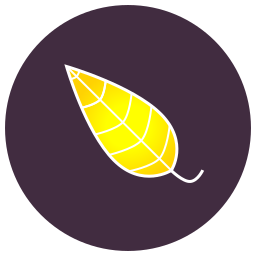

<div align="center">
  
  <h1>Samm-Bot</h1>
  
  
  
  
  
  
  
  
</div>

Samm-Bot rewritten for the fourth time, but in C# and [Discord.Net](https://github.com/discord-net/Discord.Net) instead of TypeScript and [discord.js](https://github.com/discordjs/discord.js). In constant evolution!  
It uses [Matcha](https://github.com/AestheticalZ/Matcha) for event logging!

This README file is not updated often, so sometimes it's possible for new commands or modules to be added without them being listed here.

<div align="center"><h2>Features</h2></div>

* :floppy_disk: **Bot Administration Module**: Allows the bot's owner to manage the bot remotely.
* :judge: **Moderation Module**: Allows you to kick, ban, mute, or bulk delete messages.
* :label: **Tags Module**: Allows users to create tags that make Samm-Bot reply with a custom message when used with the "tags get" command.
* :game_die: **Fun Module**: Hugging, patting, asking the magic 8-ball, and more!
* :information_source: **Information Module**: Shows information about the bot and can also show information about a user or server.
* :slot_machine: **Random Module**: Allows users to retrieve random content from the cat, dog, fox or duck APIs, or a random SCP.
* :busts_in_silhouette: **Profiles Module**: User profiles (only pronouns for now).
* :wrench: **Utils Module**: Allows you to view RGB or HEX colors, get a user's avatar, or the weather forecast of your city.
 
<div align="center"><h2>Packages & NuGet</h2></div>

Any IDE should already detect the packages you need and install them, if you're not using an IDE, .NET itself will take charge of it.   
Building should be very straightforward.

For Linux/macOS users, this [tiny script](https://gist.github.com/AestheticalZ/7969c2af2f87d606b3fd8b72cd8c6432) should make it easier for you.

:warning: **The file config.json must be filled in manually! Run the bot, and it will create an empty config.json file for you.**

:warning: **JetBrains Mono Regular is needed for the `viewhex` and `viewrgb` commands in the Utils module to work!**

<div align="center"><h2>Handling Databases</h2></div>

### Creating Migrations
Grab the command line, cd to the SammBot.Bot folder, and execute this command:

```
dotnet ef migrations add <MigrationName>
```

This will let you add columns to existing databases.

### Applying Migrations
Grab the command line, cd to the SammBot.Bot folder, and execute this command:

```
dotnet ef database update
```

This will apply the latest migration to the database.

<div align="center"><h2>Code Style Guidelines</h2></div>

Please read the [style guidelines](STYLE_GUIDELINES.md) before creating a pull request.

<div align="center"><h1>License</h1></div>

© Copyright 2022 AestheticalZ.  
Licensed under the [GPL v3.0 license](LICENSE)

<div align="center"><h1>Special Thanks</h1></div>

<div align="center">
  
  | Logo | Message |
  | ---- | ------- |
  |  | Thanks to **JetBrains** for providing   an OSS license for their products! |
</div>
